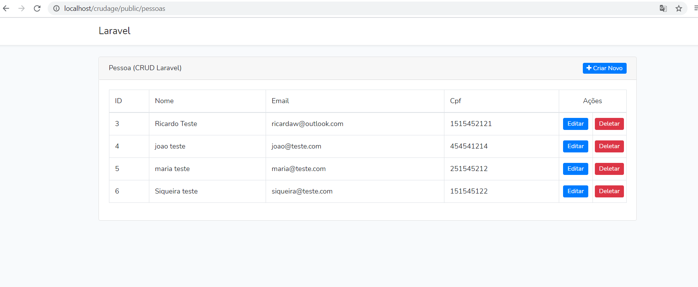

#Projeto cadastro de Pessoas 

Para rodar o projeto rode php artisan serve

url: http://localhost/crudage/public/pessoas

importe a base de dados que esta na pasta

crudage.sql

o sistema faz o cadastramento de pessoas e aparece na tabela

Criado com Laravel

